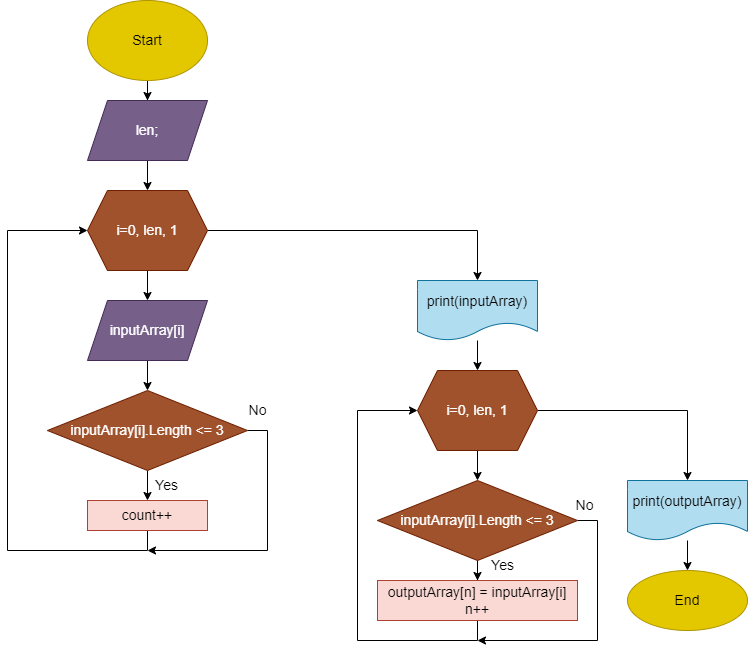

# Итоговая проверочная работа
## Задача:
Написать программу, которая из имеющего массива строк формирует массив из строк, длина которых меньше либо равна 3-м символам.
### Описание решения
1. Ввод длины исходного массива.
2. Создание исходного массива.
3. Ввод с клавиатуры элементов массива с одновременным подсчетом количества строк не длиннее 3-х символов.
(Можно было бы выделить в отдельную функцию, но тогда пришлось бы еще раз прогонять весь массив)
4. Вывод исходного массива на экран (описано отдельным методом).
5. Создание и заполнение нового массива через цикл и операцию сравнения (с использованием разных счетчиков для исходного и нового массивов)
(описано отдельной функцией).
6. Вывод нового массива на экран.
### Блок-схема:
